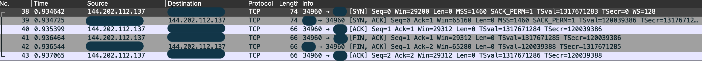

服务器在运行过程中收到疑似来自GFW的端口扫描。具有如下的特征

## 端口扫描特征  

### 服务器在短时间内（通常在几秒内）收到来自多个ip的tcp连接请求   
服务器日志片段：
```
...
2022/10/08 02:07:58: WARNING: 144.202.112.137:43246 (US) handshake failed
...
2022/10/08 02:07:59: WARNING: 185.230.210.252:51454 (SA) handshake failed
2022/10/08 02:07:59: WARNING: 61.164.253.69:55018 (CN) handshake failed
2022/10/08 02:07:59: WARNING: 185.93.245.159:44980 (AE) handshake failed
2022/10/08 02:07:59: WARNING: 82.157.45.227:37490 (CN) handshake failed
2022/10/08 02:07:59: WARNING: 82.157.24.196:49978 (CN) handshake failed
2022/10/08 02:07:59: WARNING: 82.157.22.250:48942 (CN) handshake failed
2022/10/08 02:07:59: WARNING: 101.42.134.30:40314 (CN) handshake failed
2022/10/08 02:07:59: WARNING: 82.157.15.212:56688 (CN) handshake failed
2022/10/08 02:07:59: WARNING: 43.140.210.123:53654 (CN) handshake failed
2022/10/08 02:07:59: WARNING: 82.157.16.56:45978 (CN) handshake failed
2022/10/08 02:07:59: WARNING: 43.138.6.40:54046 (CN) handshake failed
2022/10/08 02:07:59: WARNING: 185.241.124.155:53882 (AE) handshake failed
2022/10/08 02:07:59: WARNING: 43.140.211.241:41478 (CN) handshake failed
2022/10/08 02:07:59: WARNING: 47.100.164.32:47372 (CN) handshake failed
...
```

### 对端在完成tcp三次握手后立刻进行四次握手断开（非rst断开），服务器没有收到任何来自对端的数据
tcpdump抓包


### 目前仅在bandwagon的vps上收到过此类tcp端口扫描，其他vps供应商没有看到

### 扫描的周期大约为五天，但不固定，偶尔会六天甚至七天
来自同一ip的不同时间段的端口扫描
```
...
2022/09/12 02:37:31: WARNING: 144.202.112.137:32952 (US), handshake failed
2022/09/17 02:30:52: WARNING: 144.202.112.137:36918 (US), handshake failed
2022/09/22 03:56:24: WARNING: 144.202.112.137:44610 (US), handshake failed
2022/09/27 02:37:03: WARNING: 144.202.112.137:35822 (US), handshake failed
2022/10/02 03:21:37: WARNING: 144.202.112.137:44022 (US), handshake failed
2022/10/08 02:07:58: WARNING: 144.202.112.137:43246 (US), handshake failed
2022/10/14 07:28:23: WARNING: 144.202.112.137:50494 (US), handshake failed
...
```
可以看到间隔时间约为五天，后两次隔间为六天。   
由此推测每次端口扫描都由人工下命令发起。用于扫描的各机器接受指令后同步执行

## 扫描发起ip特征
总共收集到62个ip地址:
|IP|国家|提供商|
|---|---|---|
|104.36.184.122|US|IT7 Networks|
144.202.112.137
174.137.48.255
165.227.48.82
173.255.209.253
35.197.10.99
169.54.194.61
23.237.26.69
24.86.248.28
168.235.67.174
50.7.8.99
192.95.19.164
147.135.22.28
45.77.19.32
35.221.248.87
81.4.125.158
50.7.114.87
116.203.131.24
51.158.147.91
51.15.179.93
185.243.217.223
192.165.67.112
196.46.190.56
185.123.101.33
147.78.2.180
185.106.103.26
195.16.73.33
1.116.218.46
128.199.126.228
61.164.253.69
65.20.71.66
185.230.210.252
185.93.245.159
43.138.120.23
82.157.16.56
82.157.22.250
43.138.6.40
47.105.221.174
43.140.210.123
101.42.134.30
43.140.211.241
82.157.24.196
82.157.15.212
120.79.217.127
117.28.245.245
134.175.60.96
82.157.45.227
47.100.201.195
45.76.118.224
47.100.109.145
47.100.212.169
185.241.124.155
47.101.65.208
47.100.161.30
47.96.79.76
47.100.164.32
47.100.223.153
39.106.209.134
47.100.212.183
185.140.251.177
101.132.235.87
185.170.8.163

